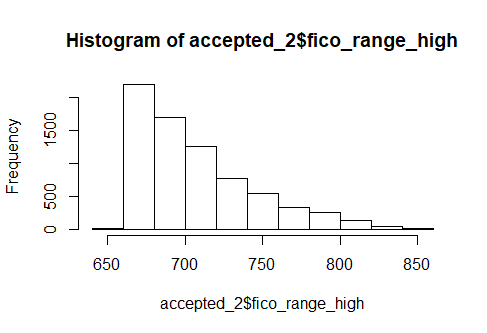
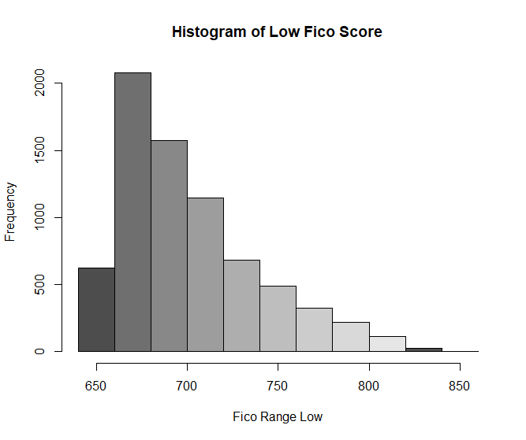

# Predicting-Mortgage-Loan-Defaults
The goal of the project is to see if the data from Lending Club can be used to predict mortgage defaults.  

# Description
This project stemmed from the need to find potential data that could be a good predictor for insurance claims and/or payment defaults on homeowners insurance policies.  I mainly focused on how predictable the loan data is on mortgage defaults because I think this provides an ample base for the predictability of the data.  I used a supervised learning technique in R to analyze this data.  The dataset came from the following site https://www.kaggle.com/wordsforthewise/lending-club. 

# Data Observations
Some questions that stemmed from data exploration.

* Is the mortgage data a good predictor of defaults?
* Which variables are highly correlated with loan status?
* Will credit information be a highly correlated variable? 

The original dataset had 150 variables and 1,646,801 observations.  The dataset consisted of observations pertaining to car loans, debt consolidation, educational, wedding, etc.

# Data Cleaning
The dataset was consolidated to only focus on mortgage loans (excluding those taken out for home improvement purposes).  I used the following code to remove the unnecessary loan types from the dataset.

accepted <- accepted[accepted$purpose!="" & accepted$purpose!="car"& accepted$purpose!="educational" & accepted$purpose!="major_purchase" & accepted$purpose!="other" & accepted$purpose!="vacation" & accepted$purpose!="credit_card" & accepted$purpose!="medical" & accepted$purpose!="renewable_energy" & accepted$purpose!="wedding" & accepted$purpose!="debt_consolidation" & accepted$purpose!="moving" & accepted$purpose!="small_business" & accepted$purpose!="home_improvement", ]

At this point in the process there are 7,286 observations and 150 variables. I then cleaned up some of the punctuations from variables like emp.title.
The next step was to change all of the character variables to numeric values.  Loan Status which had options like fully charged, charged off, current, etc. were changed to either 0 or 1.  1 represented "no default" and 0 represented "default".

accepted$loan_status[accepted$loan_status == "Fully Paid"] <- 1                                                                         
accepted$loan_status[accepted$loan_status == "Charged Off"] <- 0                                                                         
accepted$loan_status[accepted$loan_status == "Current"] <- 1                                                                             
accepted$loan_status[accepted$loan_status == "Default"] <- 0                                                                             
accepted$loan_status[accepted$loan_status == "Does not meet the credit policy. Status:Charged off"] <- 0                                 
accepted$loan_status[accepted$loan_status == "Does not meet the credit policy. Status:Charged Off"] <- 0                                 
accepted$loan_status[accepted$loan_status == "Does not meet the credit policy. Status:Fully Paid"] <- 1                                 
accepted$loan_status[accepted$loan_status == "In Grace Period"] <- 1                                                                     
accepted$loan_status[accepted$loan_status == "Late (16-30 days)"] <- 0                                                                   
accepted$loan_status[accepted$loan_status == "Late (31-120 days)"] <- 0                                                                 

The other character variables that were edited were emp_length, grade, home_ownership, verification_status, pymnt_plan, purpose, initial_list_status, application_type, verification_status_joint, disbursement_method, debt_settlement_flag, and settlement_status.  Then the character variables were changed to numeric variables using the code below.

accepted_3$id <- as.numeric(accepted_3$id)                                                                                               
accepted_3$issue_d <- as.numeric(accepted_3$issue_d)                                                                                     
accepted_3$addr_state <- as.numeric(accepted_3$addr_state)                                                                               
accepted_3$earliest_cr_line <- as.numeric(accepted_3$earliest_cr_line)                                                                   
accepted_3$last_pymnt_d <- as.numeric(accepted_3$last_pymnt_d)                                                                           
accepted_3$last_credit_pull_d <- as.numeric(accepted_3$last_credit_pull_d)                                                               
accepted_3$sec_app_earliest_cr_line <- as.numeric(accepted_3$sec_app_earliest_cr_line)                                                   
accepted_3$debt_settlement_flag_date <- as.numeric(accepted_3$debt_settlement_flag_date)                                                 
accepted_3$settlement_date <- as.numeric(accepted_3$settlement_date)                                                                     
accepted_3$term <- as.numeric(accepted_3$term)                                                                                           
accepted_3$grade <- as.numeric(accepted_3$grade)                                                                                         
accepted_3$emp_length <- as.numeric(accepted_3$emp_length)                                                                               
accepted_3$home_ownership <- as.numeric(accepted_3$home_ownership)                                                                       
accepted_3$verification_status <- as.numeric(accepted_3$verification_status)                                                             
accepted_3$loan_status <- as.numeric(accepted_3$loan_status)                                                                             
accepted_3$pymnt_plan <- as.numeric(accepted_3$pymnt_plan)                                                                               
accepted_3$purpose <- as.numeric(accepted_3$purpose)                                                                                     
accepted_3$initial_list_status <- as.numeric(accepted_3$initial_list_status)                                                             
accepted_3$application_type <- as.numeric(accepted_3$application_type)                                                                   
accepted_3$verification_status_joint <- as.numeric(accepted_3$verification_status_joint)                                                 
accepted_3$disbursement_method <- as.numeric(accepted_3$disbursement_method)                                                             
accepted_3$debt_settlement_flag <- as.numeric(accepted_3$debt_settlement_flag)                                                           
accepted_3$settlement_status <- as.numeric(accepted_3$settlement_status)                                                                 

Then the missing values were replaced using the code below.

for(i in 1:ncol(accepted_3)){                                                                                                           
  accepted_3[is.na(accepted_3[,i]), i] <- mean(accepted_3[,i], na.rm = TRUE)                                                             
}

I then viewed that data after cleaning.                                                                                                  
summary(accepted)                                                                                                                       
str(accepted)

# EDA
I also removed some of the dti outliers.        

hist(accepted$dti)                                                                                                                       
remove_outliers <- function(x, na.rm = TRUE, ...) {                                                                                          qnt <- quantile(x, probs=c(.25, .75), na.rm = na.rm, ...)                                                                                H <- 1.5 * IQR(x, na.rm = na.rm)                                                                                                        y <- x                                                                                                                                  y[x < (qnt[1] - H)] <- NA                                                                                                                y[x > (qnt[2] + H)] <- NA                                                                                                                y                                                                                                                                   
 }                                                                                                                                       
dti_no_outliers <- remove_outliers(accepted$dti)                                                                                         
hist(dti_no_outliers)                                                                                                                   

I created a few visuals to take a look at the credit scores.

hist(accepted_2$fico_range_high)

hist(accepted_2$fico_range_low)

The process for the GLM model will be in the Models section below.  However, a couple of correlation 
**NEED TO ADD MORE**

# Models
The following packages need to be loaded for each model and graphs.

library(dplyr)                                                                                                                           
library(ggplot2)                                                                                                                         
library(caret)                                                                                                                           
library(rpart)
library(rpart.plot)                                                                                                                     
library(randomForest)                                                                                                                   
library(corrplot)                                                                                                                       
library(e1071)                                                                                                                           
library(xgboost)                                                                                                                         
library(stringr)                                                                                                                         library(tm)                                                                                                                             
library(rms)                                                                                                                             
library(glmnet)                                                                                                                         
library(pscl)
library(ROCR)

#### GLM

# Analysis

# Conclusion

# References 
