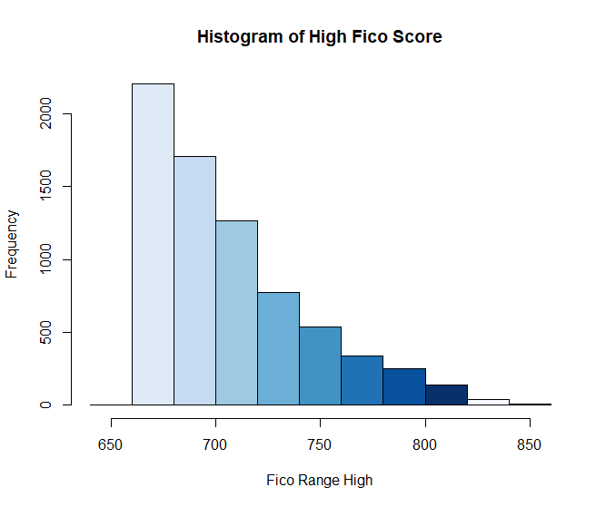

# Predicting-Mortgage-Loan-Defaults
The goal of the project is to see if the data from Lending Club can be used to predict mortgage defaults.  

# Description
This project stemmed from the need to find potential data that could be a good predictor for insurance claims and/or payment defaults on homeowners insurance policies.  I mainly focused on how predictable the loan data is on mortgage defaults because I think this provides an ample base for the predictability of the data.  I used a supervised learning technique in R to analyze this data.  The dataset came from the following site https://www.kaggle.com/wordsforthewise/lending-club. 

# Data Observations
Some questions that stemmed from data exploration.

* Is the mortgage data a good predictor of defaults?
* Which variables are highly correlated with loan status?
* Will credit information be a highly correlated variable? 

The original dataset had 150 variables and 1,646,801 observations.  The dataset consisted of observations pertaining to car loans, debt consolidation, educational, wedding, etc.

# Data Cleaning
The dataset was consolidated to only focus on mortgage loans (excluding those taken out for home improvement purposes).  I used the following code to remove the unnecessary loan types from the dataset.

accepted <- accepted[accepted$purpose!="" & accepted$purpose!="car"& accepted$purpose!="educational" & accepted$purpose!="major_purchase" & accepted$purpose!="other" & accepted$purpose!="vacation" & accepted$purpose!="credit_card" & accepted$purpose!="medical" & accepted$purpose!="renewable_energy" & accepted$purpose!="wedding" & accepted$purpose!="debt_consolidation" & accepted$purpose!="moving" & accepted$purpose!="small_business" & accepted$purpose!="home_improvement", ]

At this point in the process there are 7,286 observations and 150 variables. I then cleaned up some of the punctuations from variables like emp.title.
The next step was to change all of the character variables to numeric values.  Loan Status which had options like fully charged, charged off, current, etc. were changed to either 0 or 1.  1 represented "no default" and 0 represented "default".

accepted$loan_status[accepted$loan_status == "Fully Paid"] <- 1                                                                         
accepted$loan_status[accepted$loan_status == "Charged Off"] <- 0                                                                         
accepted$loan_status[accepted$loan_status == "Current"] <- 1                                                                             
accepted$loan_status[accepted$loan_status == "Default"] <- 0                                                                             
accepted$loan_status[accepted$loan_status == "Does not meet the credit policy. Status:Charged off"] <- 0                                 
accepted$loan_status[accepted$loan_status == "Does not meet the credit policy. Status:Charged Off"] <- 0                                 
accepted$loan_status[accepted$loan_status == "Does not meet the credit policy. Status:Fully Paid"] <- 1                                 
accepted$loan_status[accepted$loan_status == "In Grace Period"] <- 1                                                                     
accepted$loan_status[accepted$loan_status == "Late (16-30 days)"] <- 0                                                                   
accepted$loan_status[accepted$loan_status == "Late (31-120 days)"] <- 0                                                                 

The other character variables that were edited were emp_length, grade, home_ownership, verification_status, pymnt_plan, purpose, initial_list_status, application_type, verification_status_joint, disbursement_method, debt_settlement_flag, and settlement_status.  Then the character variables were changed to numeric variables using the code below.

accepted_3$id <- as.numeric(accepted_3$id)                                                                                               
accepted_3$issue_d <- as.numeric(accepted_3$issue_d)                                                                                     
accepted_3$addr_state <- as.numeric(accepted_3$addr_state)                                                                               
accepted_3$earliest_cr_line <- as.numeric(accepted_3$earliest_cr_line)                                                                   
accepted_3$last_pymnt_d <- as.numeric(accepted_3$last_pymnt_d)                                                                           
accepted_3$last_credit_pull_d <- as.numeric(accepted_3$last_credit_pull_d)                                                               
accepted_3$sec_app_earliest_cr_line <- as.numeric(accepted_3$sec_app_earliest_cr_line)                                                   
accepted_3$debt_settlement_flag_date <- as.numeric(accepted_3$debt_settlement_flag_date)                                                 
accepted_3$settlement_date <- as.numeric(accepted_3$settlement_date)                                                                     
accepted_3$term <- as.numeric(accepted_3$term)                                                                                           
accepted_3$grade <- as.numeric(accepted_3$grade)                                                                                         
accepted_3$emp_length <- as.numeric(accepted_3$emp_length)                                                                               
accepted_3$home_ownership <- as.numeric(accepted_3$home_ownership)                                                                       
accepted_3$verification_status <- as.numeric(accepted_3$verification_status)                                                             
accepted_3$loan_status <- as.numeric(accepted_3$loan_status)                                                                             
accepted_3$pymnt_plan <- as.numeric(accepted_3$pymnt_plan)                                                                               
accepted_3$purpose <- as.numeric(accepted_3$purpose)                                                                                     
accepted_3$initial_list_status <- as.numeric(accepted_3$initial_list_status)                                                             
accepted_3$application_type <- as.numeric(accepted_3$application_type)                                                                   
accepted_3$verification_status_joint <- as.numeric(accepted_3$verification_status_joint)                                                 
accepted_3$disbursement_method <- as.numeric(accepted_3$disbursement_method)                                                             
accepted_3$debt_settlement_flag <- as.numeric(accepted_3$debt_settlement_flag)                                                           
accepted_3$settlement_status <- as.numeric(accepted_3$settlement_status)                                                                 

Then the missing values were replaced using the code below.

for(i in 1:ncol(accepted_3)){                                                                                                           
  accepted_3[is.na(accepted_3[,i]), i] <- mean(accepted_3[,i], na.rm = TRUE)                                                             
}

I then viewed that data after cleaning.                                                                                                  
summary(accepted)                                                                                                                       
str(accepted)

# EDA
I also removed some of the dti outliers.        

hist(accepted$dti)                                                                                                                       
remove_outliers <- function(x, na.rm = TRUE, ...) {                                                                                          qnt <- quantile(x, probs=c(.25, .75), na.rm = na.rm, ...)                                                                                H <- 1.5 * IQR(x, na.rm = na.rm)                                                                                                        y <- x                                                                                                                                  y[x < (qnt[1] - H)] <- NA                                                                                                                y[x > (qnt[2] + H)] <- NA                                                                                                                y                                                                                                                                   
 }                                                                                                                                       
dti_no_outliers <- remove_outliers(accepted$dti)                                                                                         
hist(dti_no_outliers)                                                                                                                   

I created a few visuals to take a look at the credit scores.

hist(accepted_2$fico_range_high)

hist(accepted_2$fico_range_low)

The process for the GLM model will be in the Models section below.  However, a couple of correlation 
**NEED TO ADD MORE**

# Models
The following packages need to be loaded for each model and graphs.

library(dplyr)                                                                                                                           
library(ggplot2)                                                                                                                         
library(caret)                                                                                                                           
library(rpart)
library(rpart.plot)                                                                                                                     
library(randomForest)                                                                                                                   
library(corrplot)                                                                                                                       
library(e1071)                                                                                                                           
library(xgboost)                                                                                                                         
library(stringr)                                                                                                                         library(tm)                                                                                                                             
library(rms)                                                                                                                             
library(glmnet)                                                                                                                         
library(pscl)
library(ROCR)

#### Logistic Regression Model

I first split my data into a test and training set.  I then fit the model and the results produced nothing entirely significant.

set.seed(123)
ind = sample(2, nrow(accepted_6), replace = TRUE, prob=c(0.7,0.3))
trainloan = accepted_6[ind == 1,]
testloan = accepted_6[ind == 2,]
model <- glm(loan_status ~., family=binomial(link='logit'),data=trainloan)
summary(model)
Call:
glm(formula = loan_status ~ ., family = binomial(link = "logit"), 
    data = trainloan)

Deviance Residuals: 
   Min      1Q  Median      3Q     Max  
 -8.49    0.00    0.00    0.00    8.49  

Coefficients: (2 not defined because of singularities)
                                             Estimate Std. Error    z value Pr(>|z|)    
(Intercept)                                -1.107e+15  2.328e+08   -4756401   <2e-16 ***
id                                         -3.536e+10  4.648e+02  -76088196   <2e-16 ***
loan_amnt                                   5.758e+10  2.213e+03   26020721   <2e-16 ***
funded_amnt                                -2.535e+11  2.323e+03 -109116980   <2e-16 ***
term                                       -4.290e+12  2.149e+05  -19967517   <2e-16 ***
int_rate                                    1.013e+13  6.173e+05   16406490   <2e-16 ***
installment                                -1.010e+12  2.263e+04  -44645293   <2e-16 ***
grade                                      -1.826e+13  2.179e+06   -8381898   <2e-16 ***
emp_length                                 -2.383e+13  2.837e+05  -83986039   <2e-16 ***
home_ownership                              4.693e+13  8.229e+05   57028121   <2e-16 ***
annual_inc                                  1.509e+09  1.305e+01  115661756   <2e-16 ***
verification_status                         4.709e+12  1.328e+06    3546130   <2e-16 ***
issue_d                                     1.345e+12  2.729e+04   49263480   <2e-16 ***
pymnt_plan                                 -1.903e+15  4.838e+07  -39347375   <2e-16 ***
purpose                                            NA         NA         NA       NA    
addr_state                                 -1.650e+11  6.600e+04   -2499448   <2e-16 ***
dti                                        -7.373e+11  6.652e+04  -11082711   <2e-16 ***
delinq_2yrs                                 7.471e+12  1.732e+06    4313554   <2e-16 ***
earliest_cr_line                            1.156e+10  6.534e+03    1769709   <2e-16 ***
fico_range_low                              7.645e+14  3.928e+07   19461752   <2e-16 ***
fico_range_high                            -7.654e+14  3.928e+07  -19485438   <2e-16 ***
inq_last_6mths                             -1.066e+13  9.365e+05  -11387743   <2e-16 ***
mths_since_last_delinq                      7.250e+12  9.318e+04   77800844   <2e-16 ***
mths_since_last_record                      2.774e+12  8.541e+04   32473532   <2e-16 ***
open_acc                                    1.281e+13  8.717e+05   14699301   <2e-16 ***
revol_bal                                  -1.681e+09  1.275e+02  -13184187   <2e-16 ***
revol_util                                  1.744e+12  7.819e+04   22308197   <2e-16 ***
total_acc                                   1.228e+13  3.422e+05   35882022   <2e-16 ***
initial_list_status                         2.464e+13  2.097e+06   11750703   <2e-16 ***
out_prncp                                  -1.155e+12  5.694e+04  -20290521   <2e-16 ***
out_prncp_inv                               1.362e+12  5.696e+04   23904202   <2e-16 ***
total_pymnt                                 4.772e+10  2.214e+03   21553994   <2e-16 ***
total_pymnt_inv                            -1.987e+10  1.377e+03  -14434455   <2e-16 ***
total_rec_prncp                             2.400e+11  1.576e+03  152297121   <2e-16 ***
total_rec_int                              -3.968e+10  1.791e+03  -22151201   <2e-16 ***
total_rec_late_fee                         -5.208e+12  1.021e+05  -50998660   <2e-16 ***
last_pymnt_d                               -8.540e+12  3.546e+04 -240853298   <2e-16 ***
last_pymnt_amnt                             7.078e+09  2.344e+02   30190005   <2e-16 ***
last_credit_pull_d                          6.616e+10  4.288e+04    1543024   <2e-16 ***
last_fico_range_high                        6.452e+12  2.614e+04  246791326   <2e-16 ***
last_fico_range_low                        -4.138e+11  1.483e+04  -27901897   <2e-16 ***
collections_12_mths_ex_med                 -8.140e+13  6.225e+06  -13075849   <2e-16 ***
mths_since_last_major_derog                -1.965e+12  1.024e+05  -19179954   <2e-16 ***
application_type                            1.492e+15  1.120e+07  133275050   <2e-16 ***
annual_inc_joint                            8.046e+09  1.185e+02   67909467   <2e-16 ***
dti_joint                                   8.731e+13  1.109e+06   78726970   <2e-16 ***
verification_status_joint                   6.384e+14  1.139e+07   56026696   <2e-16 ***
acc_now_delinq                              8.744e+14  2.807e+07   31151975   <2e-16 ***
tot_coll_amt                               -6.700e+09  5.233e+02  -12802074   <2e-16 ***
tot_cur_bal                                -2.175e+09  6.253e+01  -34778227   <2e-16 ***
open_acc_6m                                -3.170e+11  1.672e+06    -189604   <2e-16 ***
open_act_il                                 6.295e+13  7.631e+05   82487797   <2e-16 ***
open_il_12m                                 5.761e+13  2.615e+06   22031683   <2e-16 ***
open_il_24m                                -7.665e+12  1.600e+06   -4791318   <2e-16 ***
mths_since_rcnt_il                          5.209e+12  6.973e+04   74710517   <2e-16 ***
total_bal_il                               -4.761e+09  5.439e+01  -87545110   <2e-16 ***
il_util                                    -1.513e+12  8.094e+04  -18688502   <2e-16 ***
open_rv_12m                                -7.375e+12  1.931e+06   -3819795   <2e-16 ***
open_rv_24m                                 3.219e+13  1.128e+06   28532926   <2e-16 ***
max_bal_bc                                  4.468e+10  3.836e+02  116470080   <2e-16 ***
all_util                                   -3.300e+12  9.407e+04  -35080289   <2e-16 ***
total_rev_hi_lim                            7.716e+09  1.095e+02   70468538   <2e-16 ***
inq_fi                                     -1.796e+13  9.662e+05  -18585522   <2e-16 ***
total_cu_tl                                 1.338e+13  6.161e+05   21718696   <2e-16 ***
inq_last_12m                                1.525e+13  6.312e+05   24167311   <2e-16 ***
acc_open_past_24mths                       -2.648e+13  7.310e+05  -36229342   <2e-16 ***
avg_cur_bal                                -1.125e+10  1.558e+02  -72200968   <2e-16 ***
bc_open_to_buy                              5.793e+09  2.095e+02   27655951   <2e-16 ***
bc_util                                    -4.505e+12  8.508e+04  -52954408   <2e-16 ***
chargeoff_within_12_mths                   -4.979e+13  9.625e+06   -5172886   <2e-16 ***
delinq_amnt                                 2.000e+10  4.212e+02   47480172   <2e-16 ***
mo_sin_old_il_acct                         -1.392e+12  2.244e+04  -62019260   <2e-16 ***
mo_sin_old_rev_tl_op                       -2.592e+11  1.312e+04  -19758517   <2e-16 ***
mo_sin_rcnt_rev_tl_op                       3.551e+11  1.016e+05    3493697   <2e-16 ***
mo_sin_rcnt_tl                             -5.340e+12  1.634e+05  -32677222   <2e-16 ***
mort_acc                                   -3.097e+13  6.773e+05  -45733107   <2e-16 ***
mths_since_recent_bc                       -1.080e+12  4.480e+04  -24119045   <2e-16 ***
mths_since_recent_bc_dlq                   -4.059e+12  1.375e+05  -29523312   <2e-16 ***
mths_since_recent_inq                      -5.914e+12  2.153e+05  -27470888   <2e-16 ***
mths_since_recent_revol_delinq             -3.129e+12  1.348e+05  -23219131   <2e-16 ***
num_accts_ever_120_pd                       1.696e+13  8.395e+05   20201199   <2e-16 ***
num_actv_bc_tl                              2.397e+13  1.329e+06   18038008   <2e-16 ***
num_actv_rev_tl                             2.369e+13  1.959e+06   12094061   <2e-16 ***
num_bc_sats                                 6.390e+13  1.065e+06   60008216   <2e-16 ***
num_bc_tl                                  -4.239e+13  6.269e+05  -67610863   <2e-16 ***
num_il_tl                                  -9.377e+12  3.969e+05  -23624036   <2e-16 ***
num_op_rev_tl                               1.463e+13  9.308e+05   15720175   <2e-16 ***
num_rev_accts                               1.939e+12  5.434e+05    3569109   <2e-16 ***
num_rev_tl_bal_gt_0                        -1.435e+13  1.997e+06   -7185320   <2e-16 ***
num_sats                                   -7.843e+13  1.026e+06  -76406931   <2e-16 ***
num_tl_120dpd_2m                           -4.626e+14  3.955e+07  -11695361   <2e-16 ***
num_tl_30dpd                               -6.211e+14  3.160e+07  -19657679   <2e-16 ***
num_tl_90g_dpd_24m                          1.118e+14  2.372e+06   47139884   <2e-16 ***
num_tl_op_past_12m                         -3.714e+13  1.209e+06  -30711022   <2e-16 ***
pct_tl_nvr_dlq                             -2.092e+11  1.406e+05   -1488270   <2e-16 ***
percent_bc_gt_75                            1.587e+12  5.320e+04   29824861   <2e-16 ***
pub_rec_bankruptcies                       -2.581e+13  2.682e+06   -9623295   <2e-16 ***
tax_liens                                  -9.767e+13  2.485e+06  -39311231   <2e-16 ***
tot_hi_cred_lim                             3.085e+09  5.668e+01   54421387   <2e-16 ***
total_bal_ex_mort                           6.436e+09  8.716e+01   73843245   <2e-16 ***
total_bc_limit                             -1.616e+10  1.616e+02 -100017592   <2e-16 ***
total_il_high_credit_limit                 -1.187e+09  8.473e+01  -14012363   <2e-16 ***
revol_bal_joint                            -3.855e+10  6.926e+02  -55657705   <2e-16 ***
sec_app_fico_range_low                     -2.013e+12  1.884e+05  -10686102   <2e-16 ***
sec_app_fico_range_high                            NA         NA         NA       NA    
sec_app_earliest_cr_line                   -8.146e+12  3.141e+05  -25930343   <2e-16 ***
sec_app_inq_last_6mths                     -5.406e+14  7.351e+06  -73533724   <2e-16 ***
sec_app_mort_acc                           -6.407e+13  6.931e+06   -9243316   <2e-16 ***
sec_app_open_acc                            9.846e+13  2.842e+06   34643010   <2e-16 ***
sec_app_revol_util                         -2.836e+13  3.326e+05  -85276935   <2e-16 ***
sec_app_open_act_il                        -2.061e+14  4.228e+06  -48743255   <2e-16 ***
sec_app_num_rev_accts                       3.372e+13  1.378e+06   24474069   <2e-16 ***
sec_app_chargeoff_within_12_mths            3.875e+15  7.209e+07   53750763   <2e-16 ***
sec_app_collections_12_mths_ex_med          5.295e+15  7.990e+07   66270331   <2e-16 ***
sec_app_mths_since_last_major_derog         4.127e+13  6.302e+05   65488887   <2e-16 ***
orig_projected_additional_accrued_interest  4.482e+12  3.803e+04  117862877   <2e-16 ***
disbursement_method                         7.978e+14  3.382e+07   23593987   <2e-16 ***
debt_settlement_flag                        8.085e+14  3.897e+07   20747463   <2e-16 ***
debt_settlement_flag_date                  -3.643e+13  3.284e+06  -11094638   <2e-16 ***
settlement_status                           1.167e+14  3.769e+07    3096442   <2e-16 ***
settlement_date                            -1.738e+14  2.896e+06  -60009412   <2e-16 ***
settlement_amount                           4.265e+11  4.181e+03  102009160   <2e-16 ***
settlement_percentage                      -5.750e+13  1.925e+06  -29868987   <2e-16 ***
settlement_term                             7.638e+12  2.167e+06    3524934   <2e-16 ***
---
Signif. codes:  0 ‘***’ 0.001 ‘**’ 0.01 ‘*’ 0.05 ‘.’ 0.1 ‘ ’ 1

(Dispersion parameter for binomial family taken to be 1)

    Null deviance: 4191.1  on 5108  degrees of freedom
Residual deviance: 8506.3  on 4987  degrees of freedom
AIC: 8750.3

Number of Fisher Scoring iterations: 24

However after running the anova model it produced some better results to work with.  I utilized the deviance statistic and the model statistics to determine which variables could be removed in order to run the Random Forsest and Decision Tree models.

Analysis of Deviance Table

Model: binomial, link: logit

Response: loan_status

Terms added sequentially (first to last)

                                           Df Deviance Resid. Df Resid. Dev  Pr(>Chi)    
NULL                                                        5108       4191              
id                                          1        4      5107       4187  0.051357 .  
loan_amnt                                   1        3      5106       4185  0.110317    
funded_amnt                                 1        1      5105       4184  0.370701    
term                                        1       26      5104       4158 3.899e-07 ***
int_rate                                    1      145      5103       4013 < 2.2e-16 ***
installment                                 1        1      5102       4012  0.296955    
grade                                       1       74      5101       3938 < 2.2e-16 ***
emp_length                                  1        0      5100       3938  0.935802    
home_ownership                              1        2      5099       3936  0.124897    
annual_inc                                  1       16      5098       3920 7.171e-05 ***
verification_status                         1        0      5097       3920  0.686192    
issue_d                                     1        3      5096       3916  0.069134 .  
pymnt_plan                                  1        8      5095       3908  0.004123 ** 
purpose                                     0        0      5095       3908              
addr_state                                  1        0      5094       3908  0.758618    
dti                                         1        1      5093       3907  0.391011    
delinq_2yrs                                 1        2      5092       3906  0.194832    
earliest_cr_line                            1        1      5091       3905  0.431106    
fico_range_low                              1       22      5090       3883 3.079e-06 ***
fico_range_high                             1        0      5089       3883  0.661529    
inq_last_6mths                              1       16      5088       3867 5.792e-05 ***
mths_since_last_delinq                      1        1      5087       3866  0.302627    
mths_since_last_record                      1        0      5086       3866  0.764024    
open_acc                                    1        2      5085       3864  0.164190    
revol_bal                                   1        0      5084       3863  0.504399    
revol_util                                  1        7      5083       3856  0.006398 ** 
total_acc                                   1        0      5082       3856  0.603211    
initial_list_status                         1       19      5081       3836 1.214e-05 ***
out_prncp                                   1      195      5080       3641 < 2.2e-16 ***
out_prncp_inv                               1        0      5079       3641  0.501575    
total_pymnt                                 1     1998      5078       1643 < 2.2e-16 ***
total_pymnt_inv                             1        0      5077       1643  0.873440    
total_rec_prncp                             1      864      5076        779 < 2.2e-16 ***
total_rec_int                               1       28      5075        751 1.101e-07 ***
total_rec_late_fee                          1        0      5074      23573  1.000000    
last_pymnt_d                                1     9948      5073      13625 < 2.2e-16 ***
last_pymnt_amnt                             1    13052      5072        573 < 2.2e-16 ***
last_credit_pull_d                          1        0      5071      66825  1.000000    
last_fico_range_high                        1        0      5070     161187  1.000000    
last_fico_range_low                         1        0      5069     169694  1.000000    
collections_12_mths_ex_med                  1   129036      5068      40657 < 2.2e-16 ***
mths_since_last_major_derog                 1        0      5067     113538  1.000000    
application_type                            1        0      5066     160755  1.000000    
annual_inc_joint                            1   131487      5065      29267 < 2.2e-16 ***
dti_joint                                   1        0      5064      29340  1.000000    
verification_status_joint                   1       72      5063      29267 < 2.2e-16 ***
acc_now_delinq                              1        0      5062      29844  1.000000    
tot_coll_amt                                1        0      5061     171496  1.000000    
tot_cur_bal                                 1     3893      5060     167603 < 2.2e-16 ***
open_acc_6m                                 1     7137      5059     160466 < 2.2e-16 ***
open_act_il                                 1        0      5058     235005  1.000000    
open_il_12m                                 1    65311      5057     169694 < 2.2e-16 ***
open_il_24m                                 1   140138      5056      29556 < 2.2e-16 ***
mths_since_rcnt_il                          1    29096      5055        460 < 2.2e-16 ***
total_bal_il                                1        0      5054        460  0.730219    
il_util                                     1        0      5053      14273  1.000000    
open_rv_12m                                 1        0      5052      18671  1.000000    
open_rv_24m                                 1     2235      5051      16436 < 2.2e-16 ***
max_bal_bc                                  1     4397      5050      12039 < 2.2e-16 ***
all_util                                    1        0      5049      23789  1.000000    
total_rev_hi_lim                            1        0      5048      50822  1.000000    
inq_fi                                      1        0      5047     213162  1.000000    
total_cu_tl                                 1   162629      5046      50533 < 2.2e-16 ***
inq_last_12m                                1        0      5045      71439  1.000000    
acc_open_past_24mths                        1    70995      5044        443 < 2.2e-16 ***
avg_cur_bal                                 1        0      5043      64662  1.000000    
bc_open_to_buy                              1    42315      5042      22347 < 2.2e-16 ***
bc_util                                     1        0      5041      90686  1.000000    
chargeoff_within_12_mths                    1        0      5040      97678  1.000000    
delinq_amnt                                 1        0      5039     107897  1.000000    
mo_sin_old_il_acct                          1    23916      5038      83982 < 2.2e-16 ***
mo_sin_old_rev_tl_op                        1        0      5037      89028  1.000000    
mo_sin_rcnt_rev_tl_op                       1        0      5036     175461  1.000000    
mo_sin_rcnt_tl                              1   114691      5035      60770 < 2.2e-16 ***
mort_acc                                    1        0      5034      98399  1.000000    
mths_since_recent_bc                        1    67113      5033      31286 < 2.2e-16 ***
mths_since_recent_bc_dlq                    1    30859      5032        427 < 2.2e-16 ***
mths_since_recent_inq                       1        0      5031     173323  1.000000    
mths_since_recent_revol_delinq              1        0      5030     182073  1.000000    
num_accts_ever_120_pd                       1   174878      5029       7195 < 2.2e-16 ***
num_actv_bc_tl                              1        0      5028     145264  1.000000    
num_actv_rev_tl                             1        0      5027     166428  1.000000    
num_bc_sats                                 1    16859      5026     149570 < 2.2e-16 ***
num_bc_tl                                   1        0      5025     168910  1.000000    
num_il_tl                                   1     2965      5024     165945 < 2.2e-16 ***
num_op_rev_tl                               1        0      5023     213756  1.000000    
num_rev_accts                               1    11432      5022     202325 < 2.2e-16 ***
num_rev_tl_bal_gt_0                         1    29171      5021     173154 < 2.2e-16 ***
num_sats                                    1        0      5020     176326  1.000000    
num_tl_120dpd_2m                            1   166594      5019       9732 < 2.2e-16 ***
num_tl_30dpd                                1     1802      5018       7930 < 2.2e-16 ***
num_tl_90g_dpd_24m                          1      505      5017       7425 < 2.2e-16 ***
num_tl_op_past_12m                          1        0      5016       8290  1.000000    
pct_tl_nvr_dlq                              1      288      5015       8002 < 2.2e-16 ***
percent_bc_gt_75                            1      288      5014       7713 < 2.2e-16 ***
pub_rec_bankruptcies                        1      433      5013       7281 < 2.2e-16 ***
tax_liens                                   1        0      5012       7713  1.000000    
tot_hi_cred_lim                             1      505      5011       7209 < 2.2e-16 ***
total_bal_ex_mort                           1        0      5010       7785  1.000000    
total_bc_limit                              1       72      5009       7713 < 2.2e-16 ***
total_il_high_credit_limit                  1        0      5008       9011  1.000000    
revol_bal_joint                             1     1370      5007       7641 < 2.2e-16 ***
sec_app_fico_range_low                      1     7254      5006        388 < 2.2e-16 ***
sec_app_fico_range_high                     0        0      5006        388              
sec_app_earliest_cr_line                    1        0      5005       8290  1.000000    
sec_app_inq_last_6mths                      1      937      5004       7353 < 2.2e-16 ***
sec_app_mort_acc                            1        0      5003       7858  1.000000    
sec_app_open_acc                            1        0      5002       8650  1.000000    
sec_app_revol_util                          1        0      5001       8650  1.000000    
sec_app_open_act_il                         1      360      5000       8290 < 2.2e-16 ***
sec_app_num_rev_accts                       1     1442      4999       6848 < 2.2e-16 ***
sec_app_chargeoff_within_12_mths            1      288      4998       6560 < 2.2e-16 ***
sec_app_collections_12_mths_ex_med          1        0      4997       9299  1.000000    
sec_app_mths_since_last_major_derog         1     1370      4996       7930 < 2.2e-16 ***
orig_projected_additional_accrued_interest  1      937      4995       6992 < 2.2e-16 ***
disbursement_method                         1        0      4994       7785  1.000000    
debt_settlement_flag                        1      288      4993       7497 < 2.2e-16 ***
debt_settlement_flag_date                   1        0      4992       7569  1.000000    
settlement_status                           1      865      4991       6704 < 2.2e-16 ***
settlement_date                             1        0      4990       8506  1.000000    
settlement_amount                           1     1298      4989       7209 < 2.2e-16 ***
settlement_percentage                       1      216      4988       6992 < 2.2e-16 ***
settlement_term                             1        0      4987       8506  1.000000    
---
Signif. codes:  0 ‘***’ 0.001 ‘**’ 0.01 ‘*’ 0.05 ‘.’ 0.1 ‘ ’ 1
anova(model, test="Chisq")

#### Random Forest Model

loan.rf

Call:
 randomForest(formula = loan_status ~ ., data = trainloanrf, importance = T) 
               Type of random forest: classification
                     Number of trees: 500
No. of variables tried at each split: 7

        OOB estimate of  error rate: 8.57%
Confusion matrix:
    0    1 class.error
0 468  262  0.35890411
1 176 4203  0.04019182
> loan.prediction = predict(loan.rf, testloanrf)
> confusionMatrix(table(loan.prediction, testloanrf$loan_status))
Confusion Matrix and Statistics

               
loan.prediction    0    1
              0  189   75
              1  125 1770
                                          
               Accuracy : 0.9074          
                 95% CI : (0.8943, 0.9193)
    No Information Rate : 0.8546          
    P-Value [Acc > NIR] : 1.084e-13       
                                          
                  Kappa : 0.601           
 Mcnemar's Test P-Value : 0.0005306       
                                          
            Sensitivity : 0.60191         
            Specificity : 0.95935         
         Pos Pred Value : 0.71591         
         Neg Pred Value : 0.93404         
             Prevalence : 0.14544         
         Detection Rate : 0.08754         
   Detection Prevalence : 0.12228         
      Balanced Accuracy : 0.78063         
                                          
       'Positive' Class : 0         

# Analysis

# Conclusion

# References 
